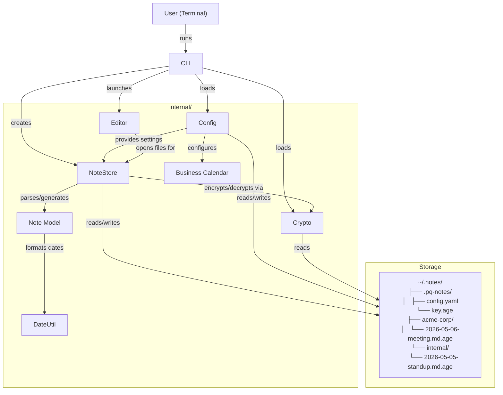

# Chapter 8: The CLI

Every application needs a front door. For pq-notes, that front door is a command-line interface built with **Cobra**, the most widely used CLI framework in the Go ecosystem (used by Kubernetes, Hugo, GitHub CLI, and many more). In this chapter, we'll see how the CLI bootstraps the application and wires all the packages together.

Think of the CLI layer as the receptionist — it receives the user's request, routes it to the right department, and returns the result.

## How It Works

The CLI is currently minimal — a root command scaffold ready for subcommands. The architecture follows Cobra's conventions:

1. **`main.go`** — the entry point that calls `cmd.Execute()`
2. **`cmd/root.go`** — defines the root command and its configuration

As the application grows, each operation (create, list, search, edit) will become a subcommand registered with the root.

## Code Deep Dive

### The Entry Point

```go
package main

import (
    "fmt"
    "os"

    "github.com/kborup-redhat/pq-notes/cmd"
)

func main() {
    if err := cmd.Execute(); err != nil {
        fmt.Fprintln(os.Stderr, err)
        os.Exit(1)
    }
}
```

Go programs start at `main()`. This one does three things:

1. Call `cmd.Execute()` to run the CLI
2. If it returns an error, print it to stderr (not stdout — errors should go to the error stream)
3. Exit with code 1 to signal failure to the shell

Using `fmt.Fprintln(os.Stderr, err)` rather than `fmt.Println(err)` is a best practice. When your program's output is piped to another program (`pq-notes list | grep acme`), errors on stderr don't corrupt the data stream on stdout.

### The Root Command

```go
package cmd

import (
    "github.com/spf13/cobra"
)

var rootCmd = &cobra.Command{
    Use:   "pq-notes",
    Short: "Post-quantum encrypted terminal notes manager",
    RunE: func(cmd *cobra.Command, args []string) error {
        return nil
    },
}

func Execute() error {
    return rootCmd.Execute()
}
```

Cobra commands have several fields:

- **`Use`** — the command name as it appears in usage text
- **`Short`** — a one-line description shown in help listings
- **`RunE`** — the function executed when this command is invoked (the `E` suffix means it returns an error, as opposed to `Run` which doesn't)

The root command currently does nothing (`return nil`). In a full application, it would either show help or run a default action. Subcommands like `pq-notes create`, `pq-notes list`, and `pq-notes search` would be registered like this:

```go
func init() {
    rootCmd.AddCommand(createCmd)
    rootCmd.AddCommand(listCmd)
    rootCmd.AddCommand(searchCmd)
}
```

### How Subcommands Would Wire Up

While the CLI is still a scaffold, here's how a `create` subcommand would bring all the packages together:

```go
var createCmd = &cobra.Command{
    Use:   "create",
    Short: "Create a new encrypted note",
    RunE: func(cmd *cobra.Command, args []string) error {
        // 1. Load config
        notesDir := config.NotesDir()
        configDir := config.ConfigDirIn(notesDir)
        cfg, err := config.Load(configDir)
        if err != nil {
            return err
        }

        // 2. Load encryption identity
        keyPath := filepath.Join(configDir, "key.age")
        identity, err := crypto.LoadIdentity(keyPath)
        if err != nil {
            return err
        }

        // 3. Create note store
        store := notes.NewNoteStore(notesDir, identity, cfg.DateFormat)

        // 4. Create the note
        note := &notes.Note{
            Customer: customerFlag,
            Type:     notes.NoteType(typeFlag),
            Created:  time.Now(),
            Status:   notes.StatusOpen,
            Title:    titleFlag,
        }

        path, err := store.Create(note)
        if err != nil {
            return err
        }

        // 5. Open in editor
        return editor.Open(cfg.Editor, path)
    },
}
```

This demonstrates the full composition:
1. **Config** provides paths and settings
2. **Crypto** loads the encryption identity
3. **NoteStore** gets constructed with its dependencies
4. **Note** model creates the data structure
5. **Editor** opens the result for the user

### Package Conventions

The `cmd` package follows Go and Cobra conventions:

- **Package-level variables** for commands (`var rootCmd = ...`) — Cobra expects this pattern for command registration
- **`Execute()` function** as the public entry point — hides the root command variable
- **Separate files per subcommand** — `root.go`, `create.go`, `list.go`, etc. (as the app grows)
- **`init()` functions** for registering subcommands and flags — called automatically when the package loads

## The Full Architecture

Now that we've seen all the pieces, here's how they compose:



## Relationships

- **Config**, **Crypto**, **NoteStore**, **Editor** — the CLI wires all of these together as the application's composition root
- **main.go** depends only on `cmd` — a clean separation between the entry point and the command logic

## Key Takeaways

- **Cobra** provides a proven pattern for Go CLIs — use it rather than reinventing argument parsing.
- **Write errors to stderr** (`os.Stderr`), not stdout, so piped output isn't corrupted.
- **Exit codes** (0 for success, 1 for failure) communicate status to the shell and scripts.
- **The CLI is the composition root** — it's where dependencies are created and wired together.
- **`internal/` packages** keep implementation details private to the module, preventing external import.
- **Start with a scaffold** and add subcommands incrementally — Cobra makes this natural.

## Wrapping Up

Congratulations! You've built a complete understanding of pq-notes — from low-level encryption primitives to high-level CLI composition. Here's what we covered:

| Chapter | Package | What It Does |
|---|---|---|
| 1 | `config` | YAML settings with OS-aware paths |
| 2 | `crypto` | Post-quantum hybrid encryption |
| 3 | `notes/note` | Note model with frontmatter and templates |
| 4 | `dateutil` | Flexible date parsing and formatting |
| 5 | `editor` | Terminal editor integration |
| 6 | `notes/store` | Encrypted CRUD orchestration |
| 7 | `calendar` | Business calendar with 40+ countries |
| 8 | `cmd` | Cobra CLI wiring |

The architecture follows clean layering principles: each package has a single responsibility, dependencies flow downward (CLI -> Store -> Crypto/Note), and all packages are testable through dependency injection.
