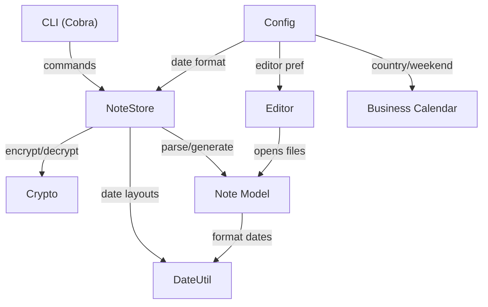

# Building a Post-Quantum Encrypted Notes Manager in Go

Welcome! In this tutorial, you'll learn how to build **pq-notes**, a terminal-based notes manager that encrypts every note with post-quantum cryptography. By the end, you'll understand how to combine Go's standard library with modern encryption, YAML-based configuration, and a clean CLI to create a practical developer tool.

## What is pq-notes?

pq-notes is a command-line application that lets you create, organize, and search notes — all encrypted at rest using **post-quantum hybrid encryption**. Think of it as a personal notebook that even a future quantum computer couldn't crack.

Notes are organized by customer, support multiple types (meetings, tasks, reminders, follow-ups), and store metadata like due dates, tags, priorities, and attendees in YAML frontmatter. The body of each note is Markdown, making them easy to write and read.

## Project Overview

Here's what pq-notes does at a high level:

- **Create** notes with type-specific templates (meeting agendas, task descriptions, etc.)
- **Encrypt** every note using post-quantum hybrid keys via the `age` library
- **Organize** notes in per-customer directories
- **Search** across all notes (titles, bodies, tags, customers)
- **List** all notes sorted by creation date
- **Edit** notes in your preferred terminal editor
- **Track** business days with country-specific holidays and custom calendars

## Architecture Overview

pq-notes follows a **layered architecture** where each package has a single, well-defined responsibility. The CLI layer sits at the top, the NoteStore orchestrates operations in the middle, and foundational packages (crypto, config, date utilities) sit at the bottom.



**Data flow for creating a note:**
1. User runs a CLI command
2. NoteStore generates a note template from the Note model
3. The template is encrypted via the Crypto package
4. The encrypted `.md.age` file is written to the customer's directory

**Data flow for reading a note:**
1. NoteStore locates the `.md.age` file
2. Crypto decrypts the file contents
3. The Note model parses YAML frontmatter and Markdown body
4. The note is returned to the caller

## Technical Stack

| Technology | Version | Purpose |
|---|---|---|
| **Go** | 1.26 | Primary language — compiled, statically typed, great for CLI tools |
| **filippo.io/age** | 1.3.1 | Post-quantum hybrid encryption (ML-KEM + X25519) |
| **spf13/cobra** | 1.10.2 | CLI framework — subcommands, flags, help generation |
| **gopkg.in/yaml.v3** | 3.0.1 | YAML parsing for config and note frontmatter |
| **rickar/cal** | 2.1.27 | Business calendar with 40+ country holiday sets |

### Why these technologies?

- **age** was chosen over GPG or NaCl because it provides a modern, opinionated encryption API with first-class post-quantum support (hybrid ML-KEM + X25519 key exchange).
- **Cobra** is the de facto standard for Go CLI applications — it handles argument parsing, help text, and subcommand routing with minimal boilerplate.
- **rickar/cal** provides pre-built holiday calendars for 40+ countries, saving the effort of maintaining holiday data manually.

## Project Structure

```
pq-notes/
├── main.go                     # Entry point
├── cmd/
│   └── root.go                 # Cobra root command
├── internal/
│   ├── calendar/
│   │   └── calendar.go         # Business calendar with holidays
│   ├── config/
│   │   └── config.go           # YAML configuration management
│   ├── crypto/
│   │   └── crypto.go           # Post-quantum encryption layer
│   ├── dateutil/
│   │   └── dateutil.go         # Date parsing and formatting
│   ├── editor/
│   │   └── editor.go           # Terminal editor integration
│   └── notes/
│       ├── note.go             # Note model and templates
│       └── store.go            # Encrypted CRUD operations
└── go.mod                      # Module definition
```

All application packages live under `internal/`, making them private to this module — a Go best practice that prevents external packages from depending on implementation details.

## What You'll Learn

- How to design a **layered Go application** with clean package boundaries
- How to use **post-quantum hybrid encryption** with the `age` library
- How to build **YAML frontmatter** parsing and generation
- How to create **type-specific templates** using Go's string builder
- How to implement **natural language date parsing** ("today", "next week", "monday")
- How to integrate **country-specific business calendars** with custom holidays
- How to wire up a **Cobra CLI** application
- How to launch and manage **external editor processes** from Go

## Prerequisites

Before starting, you should be comfortable with:

- **Go basics**: packages, structs, interfaces, error handling
- **Terminal usage**: running CLI commands, editing files
- **Encryption concepts**: public/private keys, symmetric vs asymmetric encryption (we'll explain the details)
- **YAML format**: basic key-value syntax

## Chapter Overview

| Chapter | Topic | What You'll Build |
|---|---|---|
| 1 | Configuration | YAML config with OS-aware paths and country-specific defaults |
| 2 | Crypto | Post-quantum key generation, encrypt/decrypt operations |
| 3 | Note Model | Data structures, frontmatter parsing, template generation |
| 4 | DateUtil | Flexible date parser with natural language support |
| 5 | Editor | Terminal editor launcher with VS Code support |
| 6 | NoteStore | Encrypted CRUD layer that ties everything together |
| 7 | Business Calendar | Workday calculations with 40+ country holiday sets |
| 8 | CLI | Cobra command wiring and application bootstrap |

Let's get started with Chapter 1, where we'll set up the application's configuration system.
