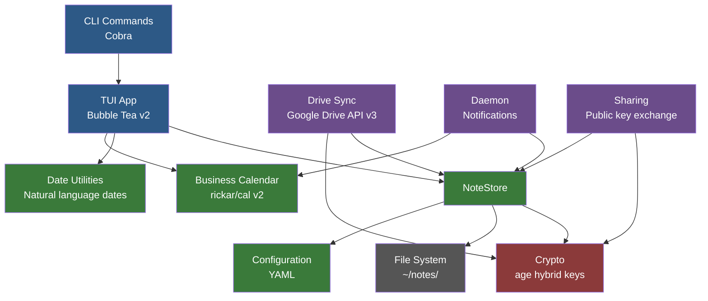

# pq-notes Tutorial

Welcome to the pq-notes developer tutorial. This guide walks you through the internals of pq-notes, a terminal-based encrypted notes manager built in Go. By the end, you will understand how each component works, how they connect, and how to extend the application yourself.

## What is pq-notes?

pq-notes is a TUI (terminal user interface) application for managing notes with post-quantum encryption. Every note you create is encrypted at rest using hybrid cryptography that resists both classical and quantum computer attacks. Notes are organized in folders, support due dates with business-day-aware scheduling, and can be synced to Google Drive in encrypted form. You can also share notes with contacts using public-key cryptography.

In short, pq-notes brings together:

- A rich terminal UI with live markdown preview
- Post-quantum encryption (X25519 + ML-KEM-768 via the age library)
- Business calendar with country-specific holidays
- Google Drive sync (encrypted -- Google never sees plaintext)
- Note sharing via public keys
- A notification daemon for due and overdue notes

## Architecture Overview

The application follows a layered architecture. CLI commands route through to the TUI application, which delegates to the NoteStore for persistence. The crypto layer handles all encryption and decryption transparently. Several integrations -- Drive sync, the notification daemon, and sharing -- build on top of these core layers.



**Core flow:** When a user creates a note in the TUI, the NoteStore generates a markdown file with YAML frontmatter, encrypts it through the Crypto layer, and writes it to disk. When Drive auto-sync is enabled, the encrypted file is immediately uploaded. The daemon periodically scans for due notes and sends desktop notifications, using the Business Calendar to skip weekends and holidays.

## Tech Stack

| Component | Technology |
|-----------|-----------|
| Language | Go 1.26 |
| TUI framework | [Bubble Tea v2](https://github.com/charmbracelet/bubbletea) |
| Markdown rendering | [Glamour v2](https://github.com/charmbracelet/glamour) |
| TUI styling | [Lip Gloss v2](https://github.com/charmbracelet/lipgloss) |
| Encryption | [filippo.io/age](https://github.com/FiloSottile/age) -- hybrid X25519 + ML-KEM-768 |
| Business calendar | [rickar/cal v2](https://github.com/rickar/cal) |
| Cloud sync | Google Drive API v3 |
| CLI framework | [Cobra](https://github.com/spf13/cobra) |
| Configuration | YAML via [gopkg.in/yaml.v3](https://pkg.go.dev/gopkg.in/yaml.v3) |

## What You'll Learn

- **Chapter 1: Configuration** -- How pq-notes stores and loads settings, directory layout, and country-aware weekend defaults
- **Chapter 2: Post-Quantum Cryptography** -- Key generation, encryption, and decryption using age hybrid keys
- **Chapter 3: The Note Model** -- Note types, priorities, statuses, frontmatter parsing, and template generation
- **Chapter 4: Date Utilities** -- Date formatting with EU/US support and natural language date parsing
- **Chapter 5: Business Calendar** -- Workday calculations, country-specific holidays, and custom holiday support

## Prerequisites

To follow along with this tutorial, you should have:

- **Go 1.26+** installed ([download](https://go.dev/dl/))
- Basic familiarity with Go (structs, interfaces, error handling)
- A terminal emulator (any modern terminal works)
- A text editor for reading source code
- (Optional) Git, for cloning the repository

No prior experience with cryptography, TUI frameworks, or calendar libraries is required -- each chapter introduces concepts from the ground up with real-world analogies before diving into code.

## Getting the Source

```bash
git clone https://github.com/kborup-redhat/pq-notes.git
cd pq-notes
```

The source files covered in this tutorial live under `internal/`:

```
internal/
  config/config.go       -- Chapter 1
  crypto/crypto.go       -- Chapter 2
  notes/note.go          -- Chapter 3
  dateutil/dateutil.go   -- Chapter 4
  calendar/calendar.go   -- Chapter 5
```

Ready? Let's start with [Chapter 1: Configuration](01-Configuration.md).
